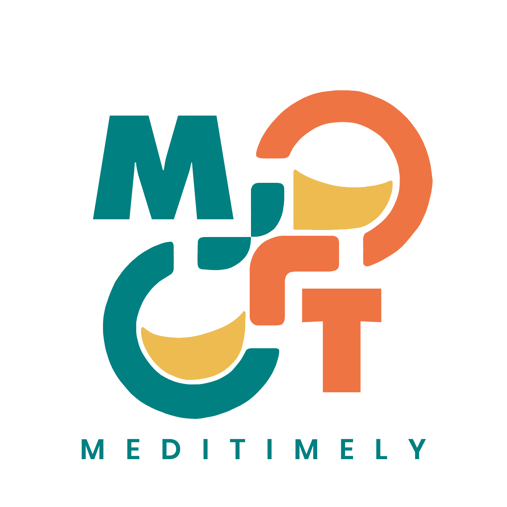
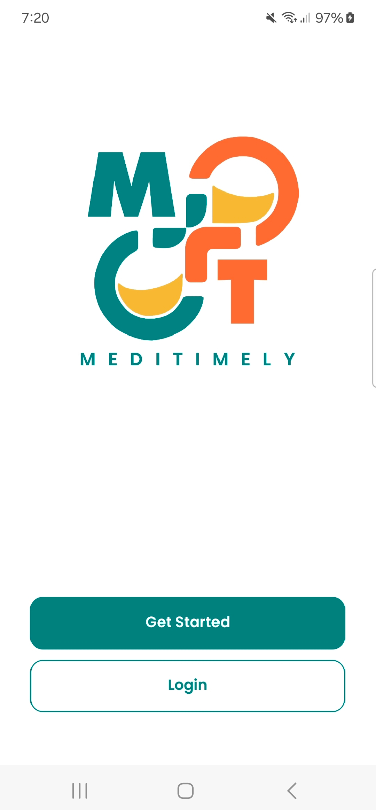
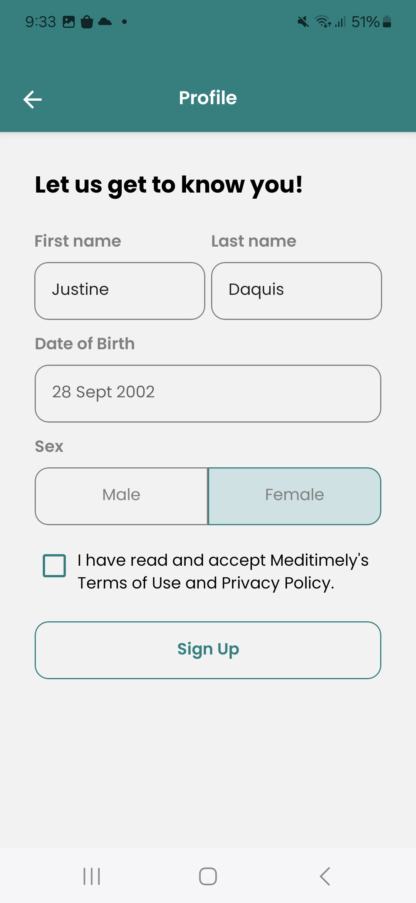
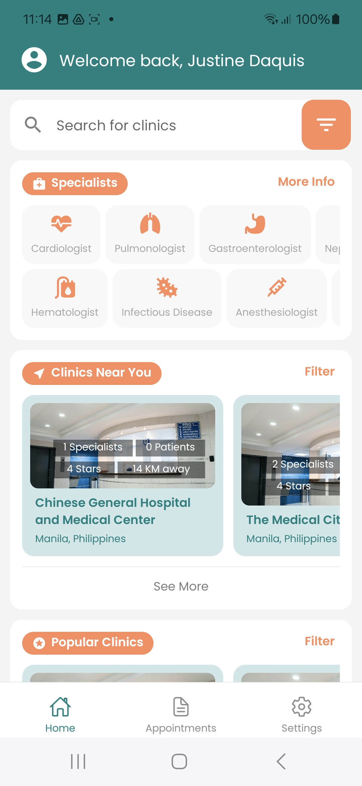
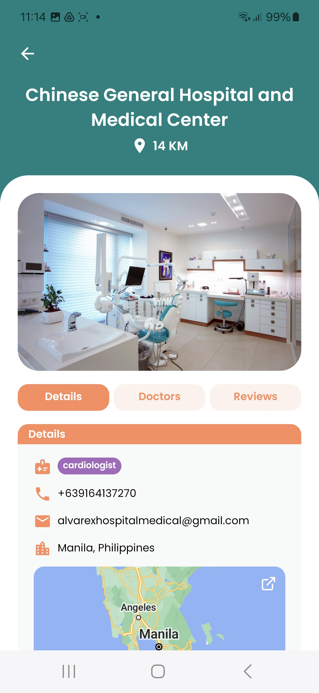
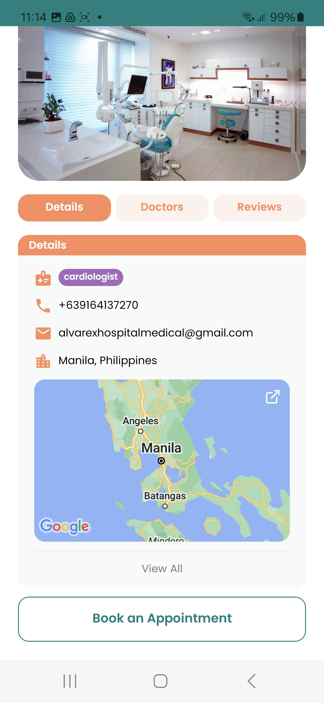
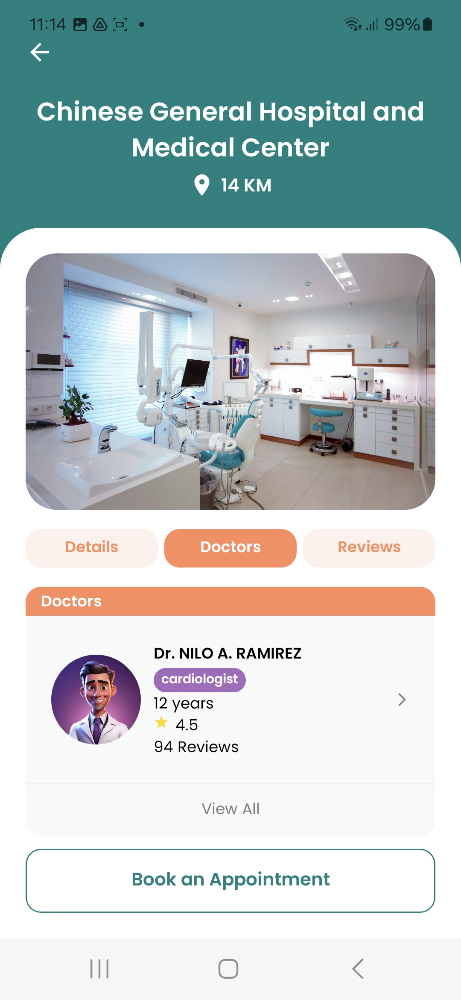
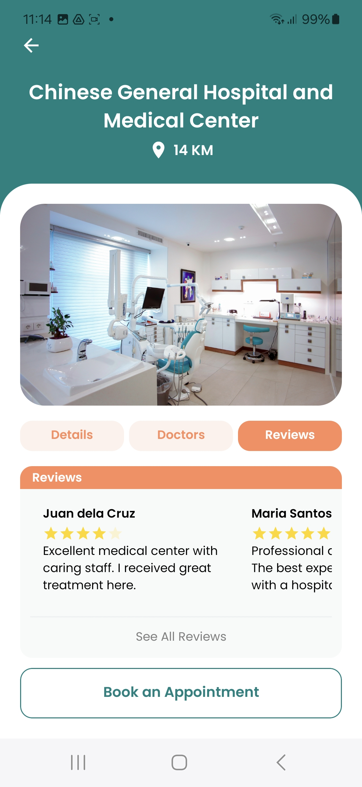
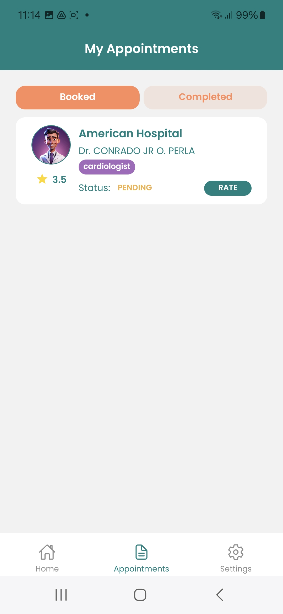
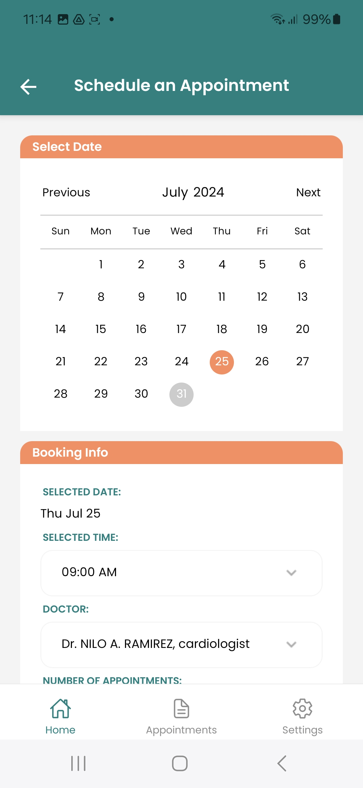

<!-- Improved compatibility of back to top link: See: https://github.com/othneildrew/Best-README-Template/pull/73 -->
<a id="readme-top"></a>
<!--
*** Thanks for checking out the Best-README-Template. If you have a suggestion
*** that would make this better, please fork the repo and create a pull request
*** or simply open an issue with the tag "enhancement".
*** Don't forget to give the project a star!
*** Thanks again! Now go create something AMAZING! :D
-->


<!-- PROJECT SHIELDS -->
<!--
*** I'm using markdown "reference style" links for readability.
*** Reference links are enclosed in brackets [ ] instead of parentheses ( ).
*** See the bottom of this document for the declaration of the reference variables
*** for contributors-url, forks-url, etc. This is an optional, concise syntax you may use.
*** https://www.markdownguide.org/basic-syntax/#reference-style-links
-->
[![Contributors][contributors-shield]][contributors-url]
[![Forks][forks-shield]][forks-url]
[![Stargazers][stars-shield]][stars-url]
[![Issues][issues-shield]][issues-url]
[![MIT License][license-shield]][license-url]
[![LinkedIn][linkedin-shield]][linkedin-url]


<!-- PROJECT LOGO -->
<br />
<div align="center">
  <a href="https://github.com/github_username/repo_name">
    
  </a>

<h3 align="center">MediTimely</h3>

  <p align="center">
    Meditimely is an innovative AI-powered mobile platform designed to revolutionize the way users access healthcare services. By leveraging advanced artificial intelligence, Meditimely simplifies the process of finding and booking healthcare facilities tailored to individual needs. Whether users are seeking specialized medical care, routine check-ups, or emergency services, Meditimely offers a seamless and intuitive experience. 
    <br />
    <a href="https://github.com/github_username/repo_name"><strong>Explore the docs »</strong></a>
    <br />
    <br />
    <a href="https://github.com/github_username/repo_name">View Demo</a>
    ·
    <a href="https://github.com/github_username/repo_name/issues/new?labels=bug&template=bug-report---.md">Report Bug</a>
    ·
    <a href="https://github.com/github_username/repo_name/issues/new?labels=enhancement&template=feature-request---.md">Request Feature</a>
  </p>
</div>
<p align="right">(<a href="#readme-top">back to top</a>)</p>

### Built With

<a href="https://reactnative.dev/docs/getting-started">
  
<picture>
  <source media="(prefers-color-scheme: dark)" srcset="https://shields.io/badge/react-black?logo=react&style=for-the-badge">
  
</picture>
</a>

<a href="https://firebase.google.com/">
<picture>
  <source media="(prefers-color-scheme: dark)" srcset="https://img.shields.io/badge/firebase-ffca28?style=for-the-badge&logo=firebase&logoColor=black">
  
</picture>
</a>

<a href="https://docs.expo.dev/eas">
<picture>
  <source media="(prefers-color-scheme: dark)" srcset="https://img.shields.io/badge/Build-fff.svg?style=for-the-badge&logo=EXPO&labelColor=fff&logoColor=000">
  
</picture>
</a>


<!-- GETTING STARTED -->
## Getting Started

The project currently is deployed using Expo Go. Read the Expo documentation on how to get things started. 

### Installation

1. Clone the repo
   ```sh
   git clone https://github.com/github_username/repo_name.git
   ```
2. Install NPM packages
   ```sh
   npm install
   ```
3. Modify Firebase config in firebase_setup.tsx file.
   ```sh
    const firebaseConfig = {
    apiKey: ####
    authDomain: ####
    databaseURL: ####
    projectId: ####
    storageBucket: ####
    messagingSenderId: ####
    appId: ####
    }
   ```

<p align="right">(<a href="#readme-top">back to top</a>)</p>

<!-- ROADMAP -->
## Roadmap

- [ ] User Login and Registration

Meditimely uses Firebase Authentication to manage user registration and authentication, providing a secure and seamless sign-in experience.

<div align="center">
  <a href="https://github.com/github_username/repo_name">
    
  </a>
    <a href="https://github.com/github_username/repo_name">
    
  </a>
<div>


- [ ] Intuitive Home Page with AI specialist recommendation

Meditimely allows users to view popular and nearest clinics, providing detailed information about each clinic to aid in decision-making. Meditimely uses AI to recommend the most suitable clinics based on user-selected specialties.

<div align="center">
  <a href="https://github.com/github_username/repo_name">
    
  </a>
    <a href="https://github.com/github_username/repo_name">
    
  </a>
    <a href="https://github.com/github_username/repo_name">
    
  </a>
    <a href="https://github.com/github_username/repo_name">
    
  </a>
    <a href="https://github.com/github_username/repo_name">
    
  </a>
  
<div>

- [ ] Book Appointments

Meditimely enables users to book appointments with their selected clinics directly through the app.

<div align="center">
  <a href="https://github.com/github_username/repo_name">
    
  </a>
  <a href="https://github.com/github_username/repo_name">
    
  </a>
<div>

<!-- CONTRIBUTING -->
## Contributing

Contributions are what make the open source community such an amazing place to learn, inspire, and create. Any contributions you make are **greatly appreciated**.

If you have a suggestion that would make this better, please fork the repo and create a pull request. You can also simply open an issue with the tag "enhancement".
Don't forget to give the project a star! Thanks again!

1. Fork the Project
2. Create your Feature Branch (`git checkout -b feature/AmazingFeature`)
3. Commit your Changes (`git commit -m 'Add some AmazingFeature'`)
4. Push to the Branch (`git push origin feature/AmazingFeature`)
5. Open a Pull Request

<p align="right">(<a href="#readme-top">back to top</a>)</p>


<!-- LICENSE -->
## License

Distributed under the MIT License. See `LICENSE.txt` for more information.

<p align="right">(<a href="#readme-top">back to top</a>)</p>


<!-- CONTACT -->
## Contact

Justine Rey Daquis - [@facebook](https://www.facebook.com/Justinedaquis28) - justinedaquis2020@gmail.com

Project Link: [https://github.com/DakissCodes/meditimely)

<p align="right">(<a href="#readme-top">back to top</a>)</p>


<!-- ACKNOWLEDGMENTS -->
## Acknowledgments

This project was part of an entry for PUP Hackathon: Uthack Ang Puhunan 2024. MediTimely was able to win 3rd runner up out of 18 teams. 

Clarence Jay Fetalino (AI Developer)
McAllen G. Fradejas (Graphic Designer)
Dennesse Loura A. Condat (Researcher)

<p align="right">(<a href="#readme-top">back to top</a>)</p>


<!-- MARKDOWN LINKS & IMAGES -->
<!-- https://www.markdownguide.org/basic-syntax/#reference-style-links -->
[contributors-shield]: https://img.shields.io/github/contributors/github_username/repo_name.svg?style=for-the-badge
[contributors-url]: https://github.com/github_username/repo_name/graphs/contributors
[forks-shield]: https://img.shields.io/github/forks/github_username/repo_name.svg?style=for-the-badge
[forks-url]: https://github.com/github_username/repo_name/network/members
[stars-shield]: https://img.shields.io/github/stars/github_username/repo_name.svg?style=for-the-badge
[stars-url]: https://github.com/github_username/repo_name/stargazers
[issues-shield]: https://img.shields.io/github/issues/github_username/repo_name.svg?style=for-the-badge
[issues-url]: https://github.com/github_username/repo_name/issues
[license-shield]: https://img.shields.io/github/license/github_username/repo_name.svg?style=for-the-badge
[license-url]: https://github.com/github_username/repo_name/blob/master/LICENSE.txt
[linkedin-shield]: https://img.shields.io/badge/-LinkedIn-black.svg?style=for-the-badge&logo=linkedin&colorB=555
[linkedin-url]: https://linkedin.com/in/linkedin_username
[product-screenshot]: images/screenshot.png
[React.js]: https://img.shields.io/badge/React-20232A?style=for-the-badge&logo=react&logoColor=61DAFB
[Firebase.js]: https://img.shields.io/badge/firebase-ffca28?style=for-the-badge&logo=firebase&logoColor=black
[React-url]: https://reactjs.org/
